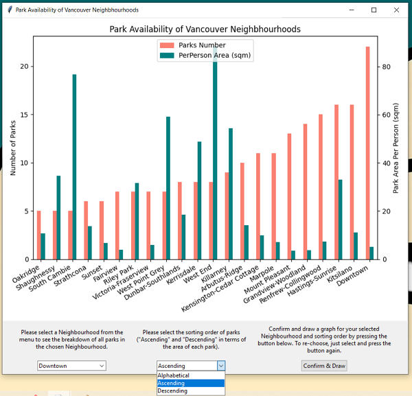

# Vancouver Parks Data Dashboard

CS5001 Spring 2023 Final Project

Kay (Mengxian) Cai

## Introduction 
This is a data dashboard in Python that analyzes the park availability in the 22 neighbourhoods of the city of Vancouver, Canada.

This project reads data from the [Vancouver Open Data Portal](https://opendata.vancouver.ca/pages/home) into two classes of objects, and analyzes the number of all parks, the total area of all parks, and the area of parks per person for each neighbourhood compared with its population. 

The results are visualized via Tkinter, and the user can see the ranking of all neighbourhoods in terms of the total number of parks, and area of parks per person. User can choose the ranking order of the results.



User can also look up a certain neighbourhood by name, and see the detailed park data of this neighbourhood, including the option to choose to display all the parks in alphabetical order or ascending/descending order in terms of the park area.


## Requirements
- matplotlib
- pandas
- requests

## How to run

   ```bash
   python data_dashboard.py
   ```